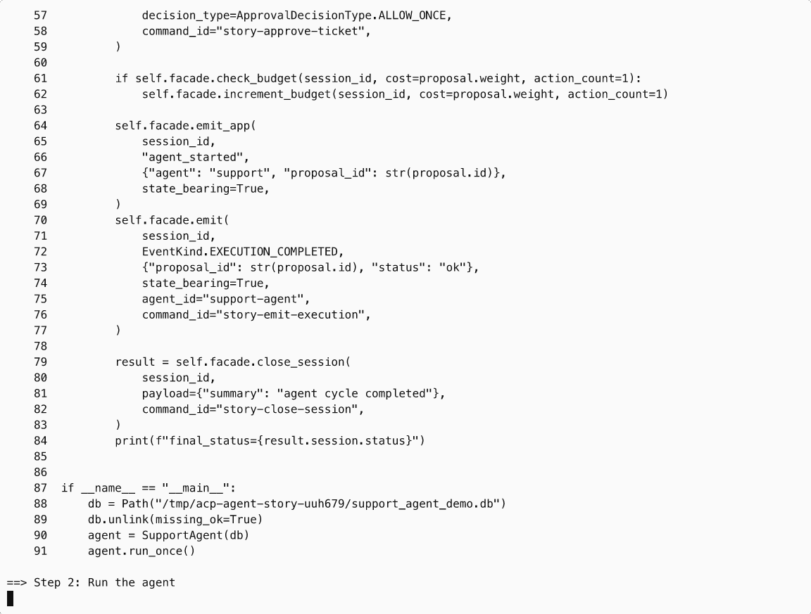

# agent-control-plane

[](https://github.com/ryanwi/agent-control-plane/actions/workflows/ci.yml)

Safety and approval controls for AI agents.

The **control plane** decides when/how an agent may act. The **data plane** executes side effects.

## Watch Demo

[Watch interactive terminal recording](https://asciinema.org/a/Mrl2E8gMbNLzNKuM)

[](https://asciinema.org/a/Mrl2E8gMbNLzNKuM)

## Why This Exists

Most agent stacks have strong execution layers but weak governance. This package provides:

- Deterministic policy enforcement before execution.
- Human/risk approval gates for high-impact actions.
- Budget guardrails and kill-switch semantics.
- Durable event history for audit, replay, and recovery.

Good fit:

- Platform teams running production agent workflows.
- Teams needing explicit human-in-the-loop and policy controls.
- Multi-agent systems requiring auditable decisions.

Less useful:

- One-off demos with no side effects.
- Prompt/tooling projects that do not need governance.

## Install

```bash
pip install agent-control-plane
```

## Local Dev

```bash
uv sync --extra dev
make check
```

## Quickstart

Use the runnable sync quickstart:

```bash
uv run python examples/quickstart_sync.py
```

Or run the full continuous-loop story demo (denied + approved outcomes):

```bash
make demo-asciicast-agent
```

Record a cast:

```bash
asciinema rec --overwrite control-plane-agent-story.cast -c "make demo-asciicast-agent"
```

## Core Capabilities

- Policy and routing: `PolicyEngine`, `ProposalRouter`
- Human approvals: `ApprovalGate`, scoped ticket decisions
- Budget enforcement: `BudgetTracker`
- Concurrency and kill switches: `ConcurrencyGuard`, `KillSwitch`
- Durable events and replay: `EventStore`
- Session lifecycle and recovery: `SessionManager`, `CrashRecovery`, `TimeoutEscalation`
- Host wrappers: `ControlPlaneFacade` (sync), `AsyncControlPlaneFacade` (async)

## Runtime Notes

- Treat `state_bearing=True` events as fail-closed.
- Prefer `ScopedModelRegistry` for production embedding.
- Use SQLite for local/single-process; use Postgres for multi-worker production.

## Docs & API

- Architecture: [docs/architecture.md](docs/architecture.md)
- Operations runbook: [docs/operations_runbook.md](docs/operations_runbook.md)
- Security model: [docs/security_model.md](docs/security_model.md)
- Identity integration: [docs/integration_identity.md](docs/integration_identity.md)
- Compatibility posture: [docs/compatibility.md](docs/compatibility.md)
- OpenAPI contract (companion gateway): [docs/openapi/control-plane-v1.yml](docs/openapi/control-plane-v1.yml)
- Public API exports: [src/agent_control_plane/__init__.py](src/agent_control_plane/__init__.py)

## Examples

- Sync quickstart: [examples/quickstart_sync.py](examples/quickstart_sync.py)
- Async quickstart: [examples/quickstart.py](examples/quickstart.py)
- Asciicast sync demo: [examples/asciinema_sync_demo.py](examples/asciinema_sync_demo.py)
- Asciicast story runner: [scripts/run_asciicast_agent_story.sh](scripts/run_asciicast_agent_story.sh)
- Audit replay: [examples/audit_viewer.py](examples/audit_viewer.py)
- MCP gateway demo: [examples/mcp_tool_gateway.py](examples/mcp_tool_gateway.py)
- Companion REST/dashboard starter: [examples/companion_gateway](examples/companion_gateway)

## License

MIT
