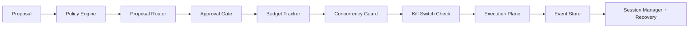

# agent-control-plane

Embeddable governance framework for autonomous agent runtimes.

In this library, the **control plane** is the authoritative layer that decides when and how an agent may act.
The **data plane** is the execution path that actually sends orders, calls services, or writes external state.

## Why this exists

Most agent stacks have strong data/IO layers but weak governance. This package provides:

- Deterministic policy enforcement before execution.
- Human and risk gates for high-impact actions.
- Budget guardrails and fail-safe stop mechanisms.
- Auditable event logs for replay and recovery.

## Install

```bash
pip install agent-control-plane
```

## Quick architecture overview

For the full reference design, see [docs/architecture.md](docs/architecture.md).



## Core components

- `PolicyEngine` classifies risk, assigns action tier, and evaluates policy limits.
- `ProposalRouter` resolves policy outcome and selected actor.
- `ApprovalGate` manages ticket creation, scoped approvals, expiry, and denial paths.
- `BudgetTracker` enforces session-level notional/count ceilings.
- `KillSwitch` provides session/system/budget emergency stop semantics.
- `ConcurrencyGuard` blocks duplicate work for the same session and resource.
- `EventStore` writes monotonic events and supports non-state-bearing buffering on DB failures.
- `SessionManager`, `CrashRecovery`, and `TimeoutEscalation` preserve continuity after failures.

## Control-plane lifecycle

1. Proposal enters the control plane with identity, intent, and resource scope.
2. Policy is applied to classify risk and derive action tier.
3. Router emits a routing decision and captures why it was chosen.
4. Approvals are checked:
   1. If no human gate is needed, the proposal proceeds.
   2. If scoped/session approval exists, it is consumed or rejected.
5. Budgets are reserved atomically.
6. Concurrency lock is acquired.
7. Proposal is executed by the downstream data plane.
8. Events are persisted, replayed, and used for recovery and audits.

## Failure semantics

- `state_bearing=True` events must fail closed (raise on persistence failure).
- Non-state-bearing telemetry events are buffered when persistence is unavailable.
- Kill switch and crash recovery paths are designed to resolve control locks deterministically.
- Timeout recovery emits escalation events and can pause sessions to prevent runaway execution.

## Installation in host application

1. Define or import SQLAlchemy models for control plane persistence.
2. Register models via `ModelRegistry.register("ModelName", YourModel)`.
3. Create and persist session/policy records with your service transaction manager.
4. Execute every control-plane transition through the engines above, not directly on models.
5. Call recovery handlers during startup and on stuck-cycle monitors.

Recommended startup sequence:

```text
ModelRegistry.register(...)
session_manager.create_session(...)
session_manager.create_policy(...)
crash_recovery.run_recovery(...)
timeout_escalation.scan_and_recover(...)
```

## ORM integration

Mixin examples and full schema details are in `agent_control_plane/models/mixins.py`.

```python
from sqlalchemy.orm import DeclarativeBase
from agent_control_plane.models.mixins import ControlSessionMixin, ControlEventMixin


class Base(DeclarativeBase):
    pass


class ControlSession(Base, ControlSessionMixin):
    __tablename__ = "control_sessions"


class ControlEvent(Base, ControlEventMixin):
    __tablename__ = "control_events"
```

## What is new compared to standard orchestration

- It governs execution, rather than only wiring agents together.
- It treats safety decisions as first-class events and audit state.
- It supports explicit recovery and stop semantics for production operation.

## Docs and API

- Architecture and lifecycle reference: [docs/architecture.md](docs/architecture.md)
- Public API surface is exported from [`agent_control_plane/__init__.py`](src/agent_control_plane/__init__.py)

## License

MIT
