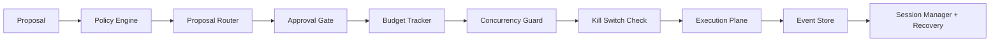

# agent-control-plane

[](https://github.com/ryanwi/agent-control-plane/actions/workflows/ci.yml)

Embeddable governance framework for autonomous agent runtimes.

In this library, the **control plane** is the authoritative layer that decides when and how an agent may act.
The **data plane** is the execution path that actually sends orders, calls services, or writes external state.

## Why this exists

Most agent stacks have strong data/IO layers but weak governance. This package provides:

- Deterministic policy enforcement before execution.
- Human and risk gates for high-impact actions.
- Budget guardrails and fail-safe stop mechanisms.
- Auditable event logs for replay and recovery.

Who should use this:

- Internal platform teams building production agent runtimes.
- Workflow and orchestration teams that need governance between planning and execution.
- Teams needing explicit human-in-the-loop, risk controls, and auditability.

Who this is less useful for:

- Single-agent demos that do not execute side effects.
- Projects that only need lightweight prompt tooling without approval, policy, or budget constraints.

## Adoption examples (non-trading)

- **Support automation with approvals:** route support tasks to agents, but require approval before account changes or refunds.
- **Research/analysis swarms:** coordinate fact-finding agents and apply scoped approvals for high-risk escalations.
- **CI/CD and platform automation:** enforce policy checks before any infrastructure change and use kill-switches for emergency halts.
- **Data and content pipelines:** guard sensitive write actions with session/resource locks and recoverable state transitions.

## Install

```bash
pip install agent-control-plane
```

## Local development setup

Preferred workflow (consistent interpreter + dependencies):

```bash
uv sync --extra dev
uv run pytest -q
```

If you prefer bare `python`/`pytest` commands, install the package in editable mode:

```bash
python -m pip install -e ".[dev]"
pytest -q
```

The repo uses a `src/` layout. If you run commands with a Python interpreter that does not have
the package installed (or you do not use `uv run`), imports like `import agent_control_plane`
will fail with `ModuleNotFoundError`.

## Quick architecture overview

For the full reference design, see [docs/architecture.md](docs/architecture.md).



## Core components

- `PolicyEngine` classifies risk, assigns action tier, and evaluates policy limits.
- `ProposalRouter` resolves policy outcome and selected actor.
- `ApprovalGate` manages ticket creation, scoped approvals, expiry, and denial paths.
- `BudgetTracker` enforces session-level cost/count ceilings.
- `KillSwitch` provides session/system/budget emergency stop semantics.
- `ConcurrencyGuard` blocks duplicate work for the same session and resource.
- `EventStore` writes monotonic events and supports non-state-bearing buffering on DB failures.
- `SessionManager`, `CrashRecovery`, and `TimeoutEscalation` preserve continuity after failures.

## Control-plane lifecycle

1. Proposal enters the control plane with identity, intent, and resource scope.
2. Policy is applied to classify risk and derive action tier.
3. Router emits a routing decision and captures why it was chosen.
4. Approvals are checked:
   1. If no human gate is needed, the proposal proceeds.
   2. If scoped/session approval exists, it is consumed or rejected.
5. Budgets are reserved atomically.
6. Concurrency lock is acquired.
7. Proposal is executed by the downstream data plane.
8. Events are persisted, replayed, and used for recovery and audits.

## Failure semantics

- `state_bearing=True` events must fail closed (raise on persistence failure).
- Non-state-bearing telemetry events are buffered when persistence is unavailable.
- Kill switch and crash recovery paths are designed to resolve control locks deterministically.
- Timeout recovery emits escalation events and can pause sessions to prevent runaway execution.

## Installation in host application

1. Define or import SQLAlchemy models for control plane persistence.
2. Register models via `ModelRegistry.register("ModelName", YourModel)`.
3. Create and persist session/policy records with your service transaction manager.
4. Execute every control-plane transition through the engines above, not directly on models.
5. Call recovery handlers during startup and on stuck-cycle monitors.

### Storage note

The control plane is designed around durable state transitions (sessions, tickets, budgets,
cycle locks, and sequencing. The engine/recovery layer depends on repository protocols, and the
package ships SQLAlchemy async and sync implementations:

- `AsyncSqlAlchemyUnitOfWork`
- `SyncSqlAlchemyUnitOfWork`
- `SyncControlPlane` convenience facade

Recommended startup sequence:

```text
register_models()
build UnitOfWork (async or sync)
construct engines with repos
session_manager.create_session(...)
session_manager.create_policy(...)
crash_recovery.run_recovery(...)
timeout_escalation.scan_and_recover(...)
```

## Troubleshooting

`ModuleNotFoundError: No module named 'agent_control_plane'`

- Cause: running `python` directly without an editable install and outside `uv run`.
- Fix: run with `uv run ...` or execute `python -m pip install -e ".[dev]"`.

`python -m pytest` says `No module named pytest`

- Cause: dependencies not installed in that interpreter.
- Fix: run `uv sync --extra dev` and use `uv run pytest`, or install `.[dev]` into that interpreter.

## 5-minute integration sketch (async)

```python
from decimal import Decimal
from uuid import uuid4
from sqlalchemy.ext.asyncio import AsyncSession

from agent_control_plane import (
    ApprovalGate,
    BudgetTracker,
    ConcurrencyGuard,
    EventStore,
    PolicyEngine,
    ProposalRouter,
    SessionManager,
    AsyncSqlAlchemyUnitOfWork,
)
from agent_control_plane.types import ActionProposalDTO, PolicySnapshotDTO


async def handle_proposal(db_session: AsyncSession, request: dict) -> None:
    uow = AsyncSqlAlchemyUnitOfWork(db_session)
    policy_snapshot = PolicySnapshotDTO(**request["policy_snapshot"])
    session_manager = SessionManager(uow.session_repo)
    event_store = EventStore(uow.event_repo)
    approval_gate = ApprovalGate(event_store, uow.approval_repo, uow.proposal_repo)
    budget = BudgetTracker(uow.session_repo)
    guard = ConcurrencyGuard(uow.session_repo, uow.proposal_repo)

    policy_id = await session_manager.create_policy(
        action_tiers=policy_snapshot.action_tiers.model_dump(mode="json"),
        risk_limits=policy_snapshot.risk_limits.model_dump(mode="json"),
        execution_mode=policy_snapshot.execution_mode.value,
        approval_timeout_seconds=policy_snapshot.approval_timeout_seconds,
        auto_approve_conditions=policy_snapshot.auto_approve_conditions.model_dump(mode="json"),
    )
    session = await session_manager.create_session(
        session_name=f"demo-session-{uuid4()}",
        execution_mode=policy_snapshot.execution_mode.value,
        max_cost=Decimal("1000"),
        max_action_count=100,
        policy_id=policy_id,
    )

    proposal = ActionProposalDTO(
        session_id=session.id,
        resource_id=request["resource_id"],
        resource_type=request.get("resource_type", "resource"),
        decision=request["decision"],
        reasoning=request.get("reasoning", "auto proposal"),
        metadata={"actor": request["actor"]},
        weight=Decimal(request.get("weight", "0")),
        score=Decimal(request.get("score", "0")),
    )
    route = ProposalRouter(PolicyEngine(policy_snapshot)).route(proposal)
    await guard.check_resource_lock(session.id, proposal.resource_id)
    if not await budget.check_budget(session.id, cost=proposal.weight, action_count=1):
        return
    await budget.increment(session.id, cost=proposal.weight, action_count=1)
    await guard.acquire_cycle(session.id, cycle_id=uuid4())
    await event_store.append(
        session_id=session.id,
        event_kind="cycle_started",
        payload={"proposal_id": str(proposal.id), "tier": route.tier.value},
        state_bearing=True,
    )
    await guard.release_cycle(session.id)
    await uow.commit()
```

For a native sync host, use `SyncControlPlane` and `examples/quickstart_sync.py`.

## ORM integration

Mixin examples and full schema details are in `agent_control_plane/models/mixins.py`.

```python
from sqlalchemy.orm import DeclarativeBase
from agent_control_plane.models.mixins import ControlSessionMixin, ControlEventMixin


class Base(DeclarativeBase):
    pass


class ControlSession(Base, ControlSessionMixin):
    __tablename__ = "control_sessions"


class ControlEvent(Base, ControlEventMixin):
    __tablename__ = "control_events"
```

## What is new compared to standard orchestration

- It governs execution, rather than only wiring agents together.
- It treats safety decisions as first-class events and audit state.
- It supports explicit recovery and stop semantics for production operation.
- This package is designed as a reusable control-plane component for an agent harness, not a single-product feature.

## Docs and API

- Architecture and lifecycle reference: [docs/architecture.md](docs/architecture.md)
- Public API surface is exported from [`agent_control_plane/__init__.py`](src/agent_control_plane/__init__.py)
- Runnable walkthrough: [`examples/quickstart.py`](examples/quickstart.py)

## License

MIT
