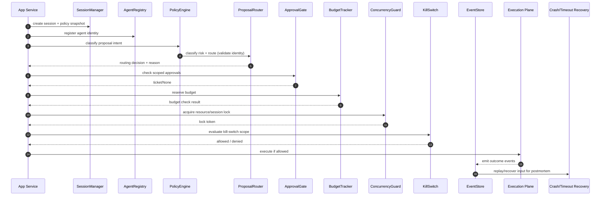

# Agent Control Plane Architecture

## 1) Positioning: control plane for autonomous agents

This package separates *decision governance* from *execution*.

It is intentionally designed as a reusable control-plane building block for:

- agent harnesses that coordinate multiple LLM/tool loops,
- workflows with human-in-the-loop approvals,
- systems needing policy/risk gating before side effects.

It is intended to be embedded into application runtimes (not replace the execution framework itself).

### Deployment posture

This package is intentionally **embedded/self-hosted** rather than a hosted control-plane platform:

- no required external control-plane SaaS,
- no vendor-owned control-plane data path,
- governance logic runs inside your application/runtime boundary.

Typical production fits:

- Agent teams that need explicit governance for autonomous support, operations, or incident-response agents.
- Multi-agent research and analysis pipelines requiring routing, scoped approvals, and recovery semantics.
- CI/CD and infrastructure automation where policy/risk checks and kill-switches are mandatory.
- Workflow systems that need auditable, resumable execution decisions (not just prompt chaining).

- **Control plane**: classify proposals, enforce policy and budgets, route to agents, arbitrate approvals, and persist authoritative events.
- **Execution plane**: carry out side effects (agent actions, tool calls, service writes, notifications, etc.).

That mirrors standard networking/control-plane patterns:
- the control plane is authoritative policy and orchestration state.
- the data plane only executes what the control plane permits.

## 2) Package architecture

The package is organized around explicit layers:

- `engine/`
  - `agent_registry` — registered agent identities and capabilities
  - `policy_engine` — risk scoring and tiering via polymorphic handlers
  - `router` — deterministic routing with identity and capability validation
  - `delegation_guard` — governed task hand-offs between agents
  - `approval_gate` — ticket lifecycle, scope handling, and timeout handling
  - `budget_tracker` — atomic session budget checks and increments
  - `session_manager` — session lifecycle and snapshots
  - `concurrency` — lock/serialize overlapping work paths
  - `kill_switch` — emergency stop semantics by scope
  - `event_store` — monotonic event persistence and buffering
- `recovery/`
  - `crash_recovery` — resume control state after process interruption
  - `timeout_escalation` — escalate stuck active cycles
- `types/` and `models/`
  - Domain/contract types, enums, and SQLAlchemy mixins for host-system integration.

## 3) Control-plane lifecycle

Use this as the reference flow for new handlers.

## 4) Key guarantees

- **Deterministic routing**: policy and router decisions should be pure and reproducible with current policy snapshot.
- **Auditable**: every meaningful control transition creates an event.
- **Fail-safety**:
  - state-bearing writes fail closed.
  - telemetry events can be buffered when persistence is temporarily unavailable.
- **Recovery-ready**: crash and timeout pathways can release stale locks and continue gracefully.
- **Human override paths**: approvals and kill switches remain explicit, configurable, and logged.

## 4b) Identity boundary and Zero Trust model

Identity/authentication is enforced at the host application boundary. The control plane consumes normalized identity context.

- App boundary responsibilities:
  - caller authentication (OIDC/JWT/service identity)
  - authorization policy checks
  - mapping caller principal -> `agent_id` and request metadata
- Control-plane responsibilities:
  - policy/risk classification
  - approval/budget/kill-switch governance
  - auditable event persistence and replay

This keeps authn/authz concerns and governance concerns separate while preserving traceability.

## 4c) Control objectives

- Prevent unauthorized or unsafe side effects before execution.
- Require explicit approvals for high-impact actions.
- Enforce hard budget ceilings on cost/action volume.
- Provide emergency stop semantics with clear scope.
- Preserve replayable audit records for investigations and postmortems.

## 5) Integration contracts

1. Register model classes with `ModelRegistry` at startup.
2. Keep all control-plane writes inside host-managed DB transactions.
3. Ensure session lifecycle is the source of truth for active cycle and status.
4. Route long-running work through one control-plane entrypoint per proposal.
5. Drive restart behavior through recovery runners before normal operation resumes.

## 5b) Persistence decoupling and abstraction

Current architecture (v0.6+):

- **Storage Protocols**: Narrow repository protocols (`SessionRepository`, `EventRepository`, etc.) decouple engines from database backends.
- **SQLAlchemy Adapters**: Production-ready `AsyncSqlAlchemyUnitOfWork` and `SyncSqlAlchemyUnitOfWork` provide row-locking and transactional integrity.
- **Model Registry**: Dynamic model resolution allows host applications to supply their own ORM classes while using standard mixins.
- **Benchmark protocol hooks**: Deterministic benchmark types and runners support repeatable policy/config experiments.
- **Policy interfaces**: `EvaluatorPolicy` and `GuardrailPolicy` protocols provide explicit extension seams for decision logic.
- **Telemetry export helpers**: `export_event(...)` and `export_scorecard(...)` bridge control-plane records to tracing/metrics systems.

Recommended backend posture:

- **SQLite**: local development and single-process embedding.
- **Postgres**: production and multi-worker deployments requiring stronger operational guarantees.

Reliability contracts:

- All control-plane mutations are expected to run in host-managed transactional boundaries.
- `state_bearing=True` persistence failures are fail-closed and must block forward progress.
- Non-state-bearing events can be buffered/observed as best effort and must not be treated as durable state commits.

Future roadmap:

1. **Native OpenTelemetry Integration**: Provide first-class OTel SDK adapters beyond protocol-level helper functions.
2. **Non-SQL Backends**: Provide optional adapters for DynamoDB or Redis using optimistic concurrency where row locking is unavailable.
3. **Optimistic-Increment Strategies**: Support high-velocity budget tracking without database serialization.

## 6) Suggested extension points

- Replace asset policy checks with a custom classifier while keeping proposal fields unchanged.
- Add new `ActionTier` and `RiskLevel` mappings as your domain adds higher granularity risk controls.
- Customize approval scope semantics (resource/region/project/team) using existing scoped ticket fields.
- For deployment/runtime composition, use experimental capability contracts in
  `agent_control_plane.experimental.capabilities` and wire providers at composition boundaries
  (for example, builder helpers). These descriptors are informational only and should not
  be treated as core governance enforcement.

## 7) Open-source framing

Most agent orchestration libraries offer coordination primitives.
This package is narrower and production-oriented:
- approval/risk/budget orchestration
- kill-switch escalation
- event-sourced recovery

Use it where correctness and operational safety matter as much as throughput.

The intended fit is:

- **High-confidence, low-latency demo agents:** optional and often overkill.
- **Production orchestration runtimes:** recommended; this package becomes the governance rail between intention and side effects.

## 7b) Known non-goals

- Not a hosted control-plane SaaS.
- Not an IAM/identity provider replacement.
- Not a full deployment/orchestration platform for model rollout management.

## 8) Public API surface (stable exports)

Exports are centralized through [agent_control_plane/__init__.py](../src/agent_control_plane/__init__.py). Use that as the canonical import surface.

| Module | Public symbols | Stability contract |
| --- | --- | --- |
| `agent_control_plane` | `PolicyEngine`, `ProposalRouter`, `ApprovalGate`, `BudgetTracker`, `ConcurrencyGuard`, `KillSwitch`, `EventStore`, `SessionManager`, `AgentRegistry`, `DelegationGuard`, `CrashRecovery`, `TimeoutEscalation`, `ModelRegistry`, `RiskClassifier`, `DefaultRiskClassifier` | Core control-plane entry points for orchestration and recovery. |
| `agent_control_plane` | `ActionName`, `ActionTier`, `RiskLevel`, `ApprovalStatus`, `ApprovalDecisionType`, `ProposalStatus`, `SessionStatus`, `EventKind`, `ExecutionMode`, `AbortReason`, `KillSwitchScope`, `RoutingResolutionStep`, `AssetMatch`, `AgentScope` | Enumerations used by all engines; considered stable between minor releases. |
| `agent_control_plane` | `ActionProposal`, `AgentMetadata`, `AgentCapability`, `DelegationProposal`, `SessionCreate`, `SessionSummary`, `PolicySnapshot`, `ApprovalScope`, `ApprovalTicket`, `RequestFrame`, `EventFrame`, `ResponseFrame`, `KillResult` | Domain/contract types are semantically stable; add optional fields in minor releases only. |
| `agent_control_plane.models` | `ModelRegistry`, `ControlSessionMixin`, `ControlEventMixin`, `ApprovalTicketMixin`, `PolicySnapshotMixin`, `AgentMixin`, `DelegationMixin` | Intended for embedding into host SQLAlchemy models and runtime bootstrapping. |
| `agent_control_plane.experimental.*` | capability contracts and other extension scaffolding | Experimental surface; may change between minor releases in pre-1.0. |
| Private internals (non-API) | `engine.*`, `recovery.*`, `types.*`, `models.*` modules | Import by direct module path only when needed; avoid for long-term compatibility. |

## 9) v0.2 packaging / release checklist

Recommended pre-release validation:

1. Documentation complete:
   - `README.md` updated and installation flow verified.
   - Architecture reference current.
   - Public APIs documented by module.
2. Runtime bootstrap validated:
   - Model registry registration and startup wiring tested.
   - Recovery checks run at process start.
3. Safety defaults verified:
   - state-bearing failures fail closed.
   - bounded buffering configured and observed.
4. Test baseline:
   - Core control-plane tests pass.
   - At least one integration-style test for ticket → budget → kill-switch path.
5. Packaging ready:
   - `pyproject.toml` version bumped.
   - `README`, license, and classifiers aligned with audience.
6. Publish checklist:
   - Validate `uv`/pip install from sdist and wheel.
   - Validate import path from installed package.

Compatibility posture and migration guidance are documented in [compatibility.md](compatibility.md).

## 10) Operational gotchas and anti-patterns

- Avoid calling model methods directly and bypassing engines; that breaks audit trails and recovery assumptions.
- Avoid sharing a single active cycle across multiple proposal streams without concurrency checks.
- Avoid unbounded scoped approvals (countless session scope without expiry) unless intentionally audited.
- Avoid swallowing `state_bearing=True` persistence errors; those failures must block the decision path.
- Avoid creating/using `EventKind` strings outside enum values.
- Avoid mutating policy snapshot data after session start; policies are designed as immutable execution anchors.

## 11) Design decisions

- ADR index: [docs/adr/README.md](adr/README.md)
- Capability detection non-enforcement: [0007](adr/0007-experimental-capabilities-informational-only.md)
- Projection strategy: [0006](adr/0006-projection-vs-canonical-reads.md)
- Idempotency model: [0004](adr/0004-idempotency-model.md)
