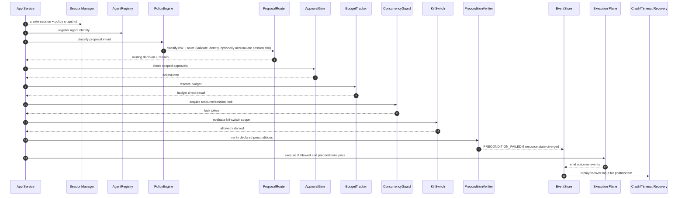

# Agent Control Plane Architecture

## 1) Positioning: control plane for autonomous agents

This package separates *decision governance* from *execution*.

It is a reusable control-plane building block for:

- agent harnesses that coordinate multiple LLM/tool loops,
- workflows with human-in-the-loop approvals,
- systems needing policy/risk gating before side effects.

It is intended to be embedded into application runtimes (not replace the execution framework itself).

### Deployment posture

This package is intentionally **embedded/self-hosted** rather than a hosted control-plane platform:

- no required external control-plane SaaS,
- no vendor-owned control-plane data path,
- governance logic runs inside your application/runtime boundary.

Typical production fits:

- Agent teams that need explicit governance for autonomous support, operations, or incident-response agents.
- Multi-agent research and analysis pipelines requiring routing, scoped approvals, and recovery semantics.
- CI/CD and infrastructure automation where policy/risk checks and kill-switches are mandatory.
- Workflow systems that need auditable, resumable execution decisions (not just prompt chaining).

- **Control plane**: classify proposals, enforce policy and budgets, route to agents, arbitrate approvals, and persist authoritative events.
- **Execution plane**: carry out side effects (agent actions, tool calls, service writes, notifications, etc.).

That mirrors standard networking/control-plane patterns:
- the control plane is authoritative policy and orchestration state.
- the data plane only executes what the control plane permits.

## 2) Package architecture

The package is organized around explicit layers:

- `engine/`
  - `agent_registry` — registered agent identities and capabilities
  - `policy_engine` — risk scoring and tiering via polymorphic handlers
  - `router` — deterministic routing with identity, capability validation, and optional session-risk accumulation
  - `delegation_guard` — governed task hand-offs between agents
  - `approval_gate` — ticket lifecycle, scope handling, and timeout handling
  - `budget_tracker` — atomic session budget checks and increments
  - `session_manager` — session lifecycle and snapshots
  - `concurrency` — lock/serialize overlapping work paths
  - `kill_switch` — emergency stop semantics by scope
  - `precondition_verifier` — optional pre-execution resource-state verification
  - `event_store` — monotonic event persistence and buffering
  - `session_risk_accumulator` — cross-action risk accumulation and pattern detection per session
  - `runtime_monitor` — cooperative mid-execution interrupt: watches session risk while an action is in flight and signals a host-implemented `CancellableExecution` to stop when risk escalates
  - `token_budget_tracker` — identity-scoped, time-windowed token budget enforcement
  - `model_governor` — model tier classification and access policy
  - `condition_evaluator` — recursive boolean condition tree evaluation
  - `parallel_evaluator` — concurrent evaluator execution with cancel-on-deny
  - `state_integrity` — session state consistency checks on resume and crash recovery
- `evaluators/`
  - `protocol` — `Evaluator` protocol and `EvaluatorResult` DTO
  - `registry` — `EvaluatorRegistry` with manual registration and entry-point discovery
  - `builtins` — `RegexEvaluator` and `ListEvaluator` built-in implementations
- `recovery/`
  - `crash_recovery` — resume control state after process interruption
  - `timeout_escalation` — escalate stuck active cycles
- `types/` and `models/`
  - Domain/contract types, enums, and SQLAlchemy mixins for host-system integration.

## 3) Control-plane lifecycle

Use this as the reference flow for new handlers.


```mermaid
sequenceDiagram
  autonumber
  participant App as App Service
  participant SP as SessionManager
  participant REG as AgentRegistry
  participant PE as PolicyEngine
  participant RT as ProposalRouter
  participant AG as ApprovalGate
  participant BT as BudgetTracker
  participant CG as ConcurrencyGuard
  participant KS as KillSwitch
  participant PV as PreconditionVerifier
  participant ES as EventStore
  participant EP as Execution Plane
  participant CR as Crash/Timeout Recovery

  App->>SP: create session + policy snapshot
  App->>REG: register agent identity
  App->>PE: classify proposal intent
  PE->>RT: classify risk + route (validate identity, optionally accumulate session risk)
  RT-->>App: routing decision + reason
  App->>AG: check scoped approvals
  AG-->>App: ticket/None
  App->>BT: reserve budget
  BT-->>App: budget check result
  App->>CG: acquire resource/session lock
  CG-->>App: lock token
  App->>KS: evaluate kill-switch scope
  KS-->>App: allowed / denied
  App->>PV: verify declared preconditions
  PV-->>ES: PRECONDITION_FAILED if resource state diverged
  App->>EP: execute if allowed and preconditions pass
  EP-->>ES: emit outcome events
  ES->>CR: replay/recover input for postmortem
```

## 4) Key guarantees

- **Deterministic routing**: policy and router decisions should be pure and reproducible with current policy snapshot.
- **Auditable**: every meaningful control transition creates an event.
- **Fail-safety**:
  - state-bearing writes fail closed.
  - telemetry events can be buffered when persistence is temporarily unavailable.
- **Recovery-ready**: crash and timeout pathways can release stale locks and continue gracefully.
- **Human override paths**: approvals and kill switches remain explicit, configurable, and logged.

## 4b) Identity boundary and Zero Trust model

Identity/authentication is enforced at the host application boundary. The control plane consumes normalized identity context.

- App boundary responsibilities:
  - caller authentication (OIDC/JWT/service identity)
  - authorization policy checks
  - mapping caller principal -> `agent_id` and request metadata
- Control-plane responsibilities:
  - policy/risk classification
  - approval/budget/kill-switch governance
  - auditable event persistence and replay

This keeps authn/authz concerns and governance concerns separate while preserving traceability.

## 4c) Control objectives

- Prevent unauthorized or unsafe side effects before execution.
- Require explicit approvals for high-impact actions.
- Enforce hard budget ceilings on cost/action volume.
- Provide emergency stop semantics with clear scope.
- Preserve replayable audit records for investigations and postmortems.

## 5) Integration contracts

1. Register model classes with `ModelRegistry` at startup.
2. Keep all control-plane writes inside host-managed DB transactions.
3. Ensure session lifecycle is the source of truth for active cycle and status.
4. Route long-running work through one control-plane entrypoint per proposal.
5. Drive restart behavior through recovery runners before normal operation resumes.

## 5b) Persistence decoupling and abstraction

Current architecture (v0.6+):

- **Storage Protocols**: Narrow repository protocols (`SessionRepository`, `EventRepository`, etc.) decouple engines from database backends.
- **SQLAlchemy Adapters**: Production-ready `AsyncSqlAlchemyUnitOfWork` and `SyncSqlAlchemyUnitOfWork` provide row-locking and transactional integrity.
- **Model Registry**: Dynamic model resolution allows host applications to supply their own ORM classes while using standard mixins.
- **Benchmark protocol hooks**: Deterministic benchmark types and runners support repeatable policy/config experiments.
- **Policy interfaces**: `EvaluatorPolicy` and `GuardrailPolicy` protocols provide explicit extension seams for decision logic.
- **Telemetry export helpers**: `export_event(...)` and `export_scorecard(...)` bridge control-plane records to tracing/metrics systems. `export_event` emits a `cp.`-namespaced attribute set (see below) that covers session identity, action identity, policy snapshot, and a `cp.outcome` derived from the event kind.

Recommended backend posture:

- **SQLite**: local development and single-process embedding.
- **Postgres**: production and multi-worker deployments requiring stronger operational guarantees.

Reliability contracts:

- All control-plane mutations are expected to run in host-managed transactional boundaries.
- `state_bearing=True` persistence failures are fail-closed and must block forward progress.
- Non-state-bearing events can be buffered/observed as best effort and must not be treated as durable state commits.

### Governance event attributes

`export_event()` emits these attributes on every call (where present):

| Attribute | Source | Notes |
|---|---|---|
| `cp.session_id` | `EventFrame.session_id` | Always present |
| `cp.event_id` | `EventFrame.event_id` | Always present |
| `cp.event_kind` | `EventFrame.event_kind` | Always present |
| `cp.seq` | `EventFrame.seq` | Monotonic cursor within the session |
| `cp.state_bearing` | `EventFrame.state_bearing` | Always present |
| `cp.agent_id` | `EventFrame.agent_id` | When set |
| `cp.correlation_id` | `EventFrame.correlation_id` | When set |
| `cp.action_id` | `payload["action_id"]` or `payload["proposal_id"]` | When present |
| `cp.policy_snapshot_id` | `payload["policy_snapshot_id"]` or `payload["policy_id"]` | When present |
| `cp.runtime_kind` | `payload["runtime_kind"]` | When set by host app |
| `cp.live_target_id` | `payload["live_target_id"]` | When set by host app |
| `cp.cwd` | `payload["cwd"]` | When set by host app |
| `cp.worktree` | `payload["worktree"]` | When set by host app |
| `cp.project_id` | `payload["project_id"]` | When set by host app |
| `cp.outcome` | Computed from `EventKind` + payload | See table below; omitted for informational events |

**`cp.outcome` vocabulary** (`GovernanceOutcome` enum):

| Outcome | EventKind(s) |
|---|---|
| `accepted` | `APPROVAL_GRANTED` |
| `applied` | `EXECUTION_COMPLETED`, `PLAN_STEP_COMPLETED` |
| `precondition_failed` | `PRECONDITION_FAILED` |
| `denied` | `APPROVAL_DENIED`, `EVALUATION_BLOCKED`, `GUARDRAIL_TOOL`, `GUARDRAIL_OUTPUT` |
| `timeout` | `APPROVAL_TIMEOUT` |
| `stale-target` | `LEASE_EXPIRED`; `HANDOFF_REJECTED` + `payload["stale_target"]` |
| `wrong-session` | `HANDOFF_REJECTED` + `payload["wrong_session"]` |
| `no-live-target` | `HANDOFF_REJECTED` + `payload["no_live_target"]` |

For event kinds not listed, `cp.outcome` is omitted. Host apps can override by setting `payload["outcome"]` to any `GovernanceOutcome` value — useful for custom event kinds or execution-plane outcomes the library cannot infer.

### Proposal preconditions

`ActionProposal.preconditions` lets callers attach optional resource-state checks that run immediately before execution, after kill-switch checks. A precondition is a `(resource_id, expected_state)` plus a `provider_id` that resolves the current state, such as `file_sha256` for a file-content hash or `env` for an environment variable value. Host applications can provide additional `PreconditionStateProvider` implementations for resources such as database rows or object-store versions.

`McpGateway` runs this verification automatically before invoking its tool executor. A failure raises `PreconditionFailedError` (a `McpGovernanceError` subclass) and emits `TOOL_CALL_BLOCKED` with `reason="precondition_failed"` — consistent with all other denial paths in the gateway. `ControlPlaneFacade.run()` also verifies preconditions automatically when they are passed as kwargs (`preconditions`, `proposal_id`, `action_id`, `precondition_providers`); a failure aborts the session and raises `RuntimeError("precondition_failed")` before the body executes. Non-MCP callers who manage execution outside of `run()` must call `verify_preconditions()` directly.

Preconditions are persisted without a schema migration under the reserved `ActionProposal.metadata_json` key `__acp_preconditions`. This key is ACP-managed internal storage and must not be used by host metadata schemas. Repository read paths decode it into `ActionProposal.preconditions` and remove it from host-facing `ActionProposal.metadata`.

### Policy simulation (`simulate_action`)

`McpGateway.simulate_action(proposal)` runs a proposal through the full `PolicyEngine` classification path and returns a `RoutingDecision` without any side effects — no proposal row is created, no approval ticket is issued, no events are appended. This is useful for agents or operators that want to preview a tier decision before committing an action.

Two caveats apply: (1) the risk accumulator is excluded, so the simulated tier may differ from the live tier if session risk has accumulated since the last real proposal; (2) agent revocation is not checked (revocation is a `SyncControlPlane` call that requires a live session, not a policy-engine concern). Both are documented in the method docstring.

### Approval ticket revocation

An approved ticket can be revoked after the fact via `ApprovalGateway.revoke_ticket()` (sync, async, and resilient variants). Revocation resets the associated proposal back to `PENDING` and appends a state-bearing `APPROVAL_REVOKED` event. The ticket's status transitions to `ApprovalStatus.REVOKED`; the `revoked_by`, `revocation_reason`, and `revoked_at` fields record who revoked it and why. Callers are responsible for re-issuing a new ticket via `create_ticket()` when manual re-approval is warranted.

Revocation is rejected when the associated proposal is already in a terminal state (`EXECUTED` or `FAILED`) — the action has already run and resetting it to `PENDING` would allow re-execution. Both facades raise `ValueError` in this case; the ticket is not modified.

### Session risk accumulation

`SessionRiskAccumulator` watches the action chain within a session and escalates the effective `RiskLevel` when accumulated score crosses thresholds or known danger sequences are detected. It sits between `classify_risk_level()` and `classify_action_tier()` in the policy flow, so a session accumulating risky history automatically receives stricter routing on subsequent proposals.

**Standard setup path** — pass `risk_patterns` to `GovernanceConfig`; `ControlPlaneSetup.build()` auto-constructs a `SessionRiskAccumulator` and wires it into the facade:

```python
cp = ControlPlaneSetup(
    database_url="sqlite:///./cp.db",
    governance=GovernanceConfig(
        risk_patterns=[
            RiskPattern(
                name="exfil_chain",
                action_sequence=["read_crm", "query_database", "send_email"],
                window_size=10,
                escalate_to=RiskLevel.HIGH,
            )
        ],
    ),
).build()
```

`ControlPlaneFacade.from_database_url()` also accepts `risk_accumulator` directly for custom configurations. When escalation is triggered, `route_proposal()` appends a non-state-bearing `SESSION_RISK_ESCALATED` event to the audit log and the returned `RoutingDecision` has `risk_escalated=True` with the escalated tier.

The accumulator is in-process and in-memory per facade instance. Construct it without an `event_store` when using the sync `ControlPlaneFacade` — `route_proposal()` handles event emission through the sync event system.

### Cooperative mid-execution interrupt (`RuntimeMonitor`)

The `SessionRiskAccumulator` acts *between* proposals: the next proposal is routed with an
escalated risk level once thresholds are crossed. But once an action clears `KillSwitch`
and executes, the control plane is blind to it until `EventStore.append()` closes the loop.
`RuntimeMonitor` fills that gap **without owning the executor** — ACP is a governance
library, so it signals and the host decides what to do.

Host executors opt in by implementing the `CancellableExecution` protocol:

- `async def cancel(self, reason: str) -> None` — ACP's request to stop the in-flight
  action. The executor decides what "cancel" means (asyncio task cancellation, setting a
  `threading.Event`, writing a stop file, signalling a subprocess, …).
- `@property def is_running(self) -> bool` — lets ACP skip the call if execution already
  completed naturally.

`RuntimeMonitor` takes a `CancellableExecution` handle and a `SessionRiskAccumulator`.
Its `watch(session_id, proposal, action_risk_level)` (or the `watching(...)` async context
manager) starts a background poll loop that re-checks risk with the non-mutating
`SessionRiskAccumulator.peek()`. When the effective risk escalates above the admitted
level *and* reaches a configurable threshold (default `HIGH`; `poll_interval_seconds`
default `0.25`), the monitor records a **state-bearing** `RUNTIME_INTERRUPT_REQUESTED`
event and calls `execution.cancel()` — exactly once per watch. `peek()` does not re-add the
in-flight proposal to the accumulated score, so polling is idempotent rather than inflating
risk each cycle.

Design guarantees:

- **Cooperative, not coercive.** ACP asks and records; whether the executor actually stops
  is the executor's responsibility. The audit log records the request regardless.
- **Observe, don't intercept.** The monitor never alters the execution result and never
  swallows executor errors — both propagate unchanged.
- **Fail-closed audit.** `RUNTIME_INTERRUPT_REQUESTED` is `state_bearing=True`; a
  persistence failure raises (the monitor records the request *before* calling `cancel()`).

`McpGateway` wires this in as an optional path: supply `McpGatewayConfig.execution_factory`
(a `Callable[[ToolCallContext], CancellableExecution]`) and a `SessionRiskAccumulator`
(passed to the gateway or carried by the `SyncControlPlane`). The gateway then wraps each
`executor.execute()` in a `RuntimeMonitor.watching()` context, running the blocking executor
in a worker thread so the poll loop stays responsive. `ControlPlaneFacade.run()` is *not*
wired — its execution body is caller-managed by design, so callers compose `RuntimeMonitor`
directly when they want the same behaviour.

Future roadmap:

1. **Native OpenTelemetry Integration**: Provide first-class OTel SDK adapters beyond protocol-level helper functions.
2. **Non-SQL Backends**: Provide optional adapters for DynamoDB or Redis using optimistic concurrency where row locking is unavailable.
3. **Optimistic-Increment Strategies**: Support high-velocity budget tracking without database serialization.

## 6) Suggested extension points

- Replace asset policy checks with a custom classifier while keeping proposal fields unchanged.
- Add new `ActionTier` and `RiskLevel` mappings as your domain adds higher granularity risk controls.
- Use `ActionTier.STEER` to return corrective guidance instead of blocking — configure via `ActionTiers.steer` list.
- Build composite policy rules with condition trees (`AndCondition`, `OrCondition`, `NotCondition`) and plug them into `AutoApproveConditions.condition_tree`.
- Register custom evaluators via `EvaluatorRegistry` or the `agent_control_plane.evaluators` entry-point group for domain-specific policy checks.
- Use `ParallelPolicyEvaluator` for concurrent evaluation of multiple evaluators with early cancellation on first deny.
- Use `EgressEvaluator` to model outbound access as capability grants rather than a destination allowlist — reaching a host is necessary but does not implicitly permit every operation there.
- Customize approval scope semantics (resource/region/project/team) using existing scoped ticket fields.
- For deployment/runtime composition, use experimental capability contracts in
  `agent_control_plane.experimental.capabilities` and wire providers at composition boundaries
  (for example, builder helpers). These descriptors are informational only and should not
  be treated as core governance enforcement.

## 7) Open-source framing

Agent orchestration libraries handle coordination. This package handles governance:
- approval/risk/budget orchestration
- kill-switch escalation
- event-sourced recovery

Production safety systems need it; quick demos probably don't.

The intended fit is:

- **High-confidence, low-latency demo agents:** optional and often overkill.
- **Production orchestration runtimes:** recommended; this package becomes the governance rail between intention and side effects.

## 7b) Known non-goals

- Not a hosted control-plane SaaS.
- Not an IAM/identity provider replacement.
- Not a full deployment/orchestration platform for model rollout management.

## 8) Public API surface (stable exports)

Exports are centralized through [agent_control_plane/__init__.py](../src/agent_control_plane/__init__.py). Use that as the canonical import surface.

| Module | Public symbols | Stability contract |
| --- | --- | --- |
| `agent_control_plane` | `ControlPlaneSetup`, `GovernanceConfig`, `EventConfig`, `ResilienceConfig` | Recommended entry point. Builder that wires engines, storage, and policy into a ready-to-use gateway set. |
| `agent_control_plane` | `SessionGateway`, `ApprovalGateway`, `BudgetGateway`, `AgenticGateway` | Focused sync gateway objects (≤ 11 public methods each) returned by `ControlPlaneSetup.build()`. |
| `agent_control_plane` | `ResilientControlPlane`, `ResiliencePolicy`, `ResilienceMode` | Resilient wrapper around `ControlPlaneFacade`; configurable fail-open/fail-closed per operation category. |
| `agent_control_plane` | `ResilientSessionGateway`, `ResilientApprovalGateway`, `ResilientBudgetGateway`, `ResilientAgenticGateway`, `ResilientObserverGateway` | Gateway-shaped views into `ResilientControlPlane`. |
| `agent_control_plane` | `ControlPlaneFacade`, `SyncControlPlane` | Low-level sync facade (advanced use). |
| `agent_control_plane` | `AsyncControlPlaneFacade`, `AsyncSessionGateway`, `AsyncApprovalGateway`, `AsyncBudgetGateway`, `AsyncAgenticGateway`, `AsyncLifecycleGateway`, `AsyncMaintenanceGateway` | Async gateway variants; use in async runtimes. |
| `agent_control_plane` | `AsyncResilientControlPlane`, `AsyncResilientSessionGateway`, `AsyncResilientApprovalGateway`, `AsyncResilientBudgetGateway`, `AsyncResilientAgenticGateway`, `AsyncResilientObserverGateway`, `AsyncResilientLifecycleGateway`, `AsyncResilientMaintenanceGateway` | Resilient async gateway variants. |
| `agent_control_plane` | `McpGateway`, `McpGatewayConfig`, `McpGovernanceError`, `PolicyDeniedError`, `ApprovalRequiredError`, `BudgetDeniedError`, `KillSwitchActiveError`, `SteeringRequiredError`, `PreconditionFailedError`, `ToolExecutionError`, `ToolResultRejectedError` | Governs MCP tool calls through the control plane; all denial paths raise a `McpGovernanceError` subclass. |
| `agent_control_plane` | `PolicyEngine`, `ProposalRouter`, `SessionRiskAccumulator`, `ApprovalGate`, `BudgetTracker`, `ConcurrencyGuard`, `KillSwitch`, `PreconditionVerifier`, `EventStore`, `SessionManager`, `AgentRegistry`, `DelegationGuard`, `CrashRecovery`, `TimeoutEscalation`, `ModelRegistry`, `RiskClassifier`, `DefaultRiskClassifier`, `ConditionEvaluator`, `ParallelPolicyEvaluator` | Individual engines for direct wiring (advanced). |
| `agent_control_plane` | `ActionName` (UNKNOWN sentinel only), `ActionTier`, `RiskLevel`, `ApprovalStatus`, `ApprovalDecisionType`, `ProposalStatus`, `SessionStatus`, `EventKind`, `ExecutionMode`, `AbortReason`, `KillSwitchScope`, `RoutingResolutionStep`, `AssetMatch`, `AgentScope`, `GovernanceOutcome` | Enumerations used by all engines; considered stable between minor releases. Use plain strings for domain action names (`ActionValue = ActionName \| str`). |
| `agent_control_plane` | `ActionProposal`, `Precondition`, `PreconditionVerificationResult`, `PreconditionStateProvider`, `AgentMetadata`, `AgentCapability`, `DelegationProposal`, `SessionCreate`, `SessionSummary`, `PolicySnapshot`, `ApprovalScope`, `ApprovalTicket`, `RequestFrame`, `EventFrame`, `ResponseFrame`, `KillResult`, `SteeringContext`, `ConditionNode`, `EvaluatorResult`, `ParallelEvaluationResult`, `EmitMetadata` | Domain/contract types are semantically stable; add optional fields in minor releases only. |
| `agent_control_plane` | `EgressEvaluator`, `EgressEvaluatorConfig`, `EgressGrant` | Egress capability-grant evaluator; plugs into the async `Evaluator` framework. |
| `agent_control_plane.evaluators` | `Evaluator`, `EvaluatorRegistry`, `EvaluatorResult`, `RegexEvaluator`, `ListEvaluator` | Pluggable evaluator protocol, registry, and built-in implementations. |
| `agent_control_plane.models` | `ModelRegistry`, `ControlSessionMixin`, `ControlEventMixin`, `ApprovalTicketMixin`, `PolicySnapshotMixin`, `AgentMixin`, `DelegationMixin` | Intended for embedding into host SQLAlchemy models and runtime bootstrapping. |
| `agent_control_plane.experimental.*` | capability contracts and other extension scaffolding | Experimental surface; may change between minor releases in pre-1.0. |
| Private internals (non-API) | `engine.*`, `recovery.*`, `types.*`, `models.*` modules | Import by direct module path only when needed; avoid for long-term compatibility. |

## 9) v0.2 packaging / release checklist

Recommended pre-release validation:

1. Documentation complete:
   - `README.md` updated and installation flow verified.
   - Architecture reference current.
   - Public APIs documented by module.
2. Runtime bootstrap validated:
   - Model registry registration and startup wiring tested.
   - Recovery checks run at process start.
3. Safety defaults verified:
   - state-bearing failures fail closed.
   - bounded buffering configured and observed.
4. Test baseline:
   - Core control-plane tests pass.
   - At least one integration-style test for ticket → budget → kill-switch path.
5. Packaging ready:
   - `pyproject.toml` version bumped.
   - `README`, license, and classifiers aligned with audience.
6. Publish checklist:
   - Validate `uv`/pip install from sdist and wheel.
   - Validate import path from installed package.

Compatibility posture and migration guidance are documented in [compatibility.md](compatibility.md).

## 10) Operational gotchas and anti-patterns

- Avoid calling model methods directly and bypassing engines; that breaks audit trails and recovery assumptions.
- Avoid re-implementing approval write paths outside the facade — `get_ticket_for_update()` and `get_pending_ticket_for_update()` hold a `FOR UPDATE` row lock; bypassing them loses the lock and can produce silent last-write-wins races under concurrency.
- Avoid sharing a single active cycle across multiple proposal streams without concurrency checks.
- Avoid unbounded scoped approvals (countless session scope without expiry) unless intentionally audited.
- Avoid swallowing `state_bearing=True` persistence errors; those failures must block the decision path.
- Avoid creating/using `EventKind` strings outside enum values.
- Avoid mutating policy snapshot data after session start; policies are designed as immutable execution anchors.

## 11) Design decisions

- ADR index: [docs/adr/README.md](adr/README.md)
- Gateway decomposition (v0.18): [0010](adr/0010-gateway-decomposition.md)
- Integration patterns (resilient facade, setup builder): [0009](adr/0009-integration-patterns.md)
- Capability detection non-enforcement: [0007](adr/0007-experimental-capabilities-informational-only.md)
- Projection strategy: [0006](adr/0006-projection-vs-canonical-reads.md)
- Idempotency model: [0004](adr/0004-idempotency-model.md)
